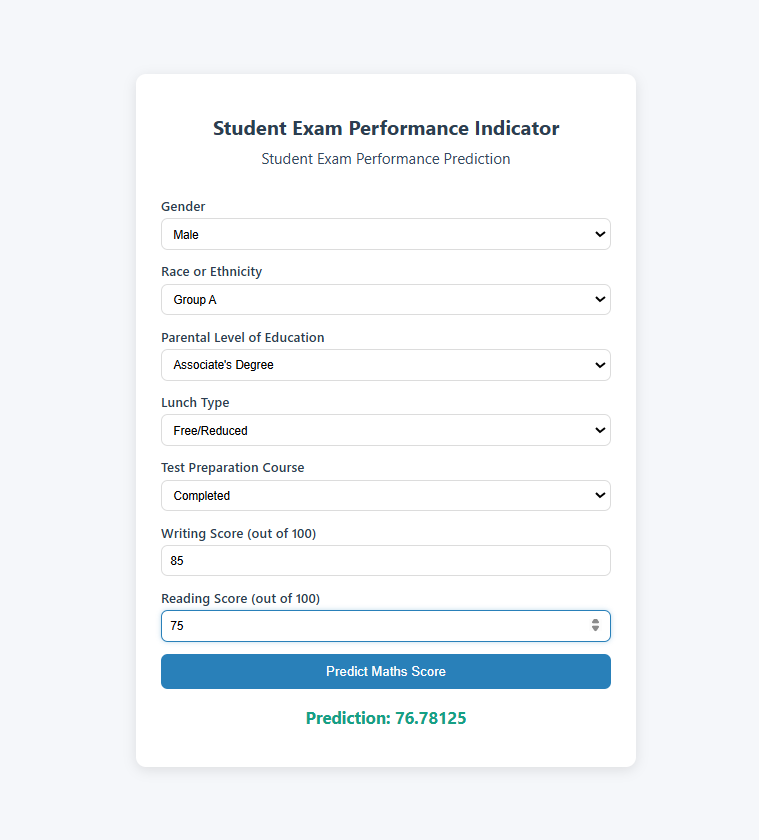

🎓 Student Performance Prediction – End-to-End ML Project
   📌 Project Overview

  This project is an end-to-end Machine Learning pipeline built to predict student performance based on 
  various academic and personal factors.The project covers the complete ML lifecycle — from EDA, 
  data ingestion, transformation, training, hyperparameter tuning, prediction pipeline to local 
  deployment using Flask.
  
  The project is structured following best practices for modular ML development, with components for 
  ingestion, transformation, training, prediction, logging, exception handling, and deployment.

📸 Screenshots:-
  ## 🚀 Deployed Application (Local)
   Here’s a screenshot of the locally deployed Flask app:
       

##📂 Project Structure
            ML_STUDENT_PERFORMANCE/
      │── artifacts/               # Saved datasets, models, preprocessors
      │   ├── data.csv
      │   ├── train.csv
      │   ├── test.csv
      │   ├── model.pkl
      │   └── preprocessor.pkl
      │
      │── notebook/                # Jupyter notebooks for EDA & Model Training
      │   ├── 1. EDA STUDENT PERFORMANCE.ipynb
      │   └── 2. MODEL TRAINING.ipynb
      │
      │── src/                     # Source code for ML pipeline
      │   ├── components/          # Core ML steps
      │   │   ├── data_ingestion.py
      │   │   ├── data_transformation.py
      │   │   └── model_trainer.py
      │   │
      │   ├── pipeline/            # End-to-end training & prediction pipelines
      │   │   ├── train_pipeline.py
      │   │   └── predict_pipeline.py
      │   │
      │   ├── utils.py             # Utility functions
      │   ├── logger.py            # Logging setup
      │   └── exception.py         # Custom exception handling
      │
      │── static/                  # CSS and static files
      │   └── styles.css
      │
      │── templates/               # Frontend HTML templates
      │   ├── index.html
      │   └── home.html
      │
      │── app.py                   # Flask application entry point
      │── requirements.txt         # Project dependencies
      │── setup.py                 # For packaging and installation
      │── README.md                # Project documentation
      │── .gitignore               # Ignore unnecessary files

##🔑 Key Steps Implemented

   ✔ Project Setup & Deployment with GitHub
   ✔ Logging & Exception Handling
   ✔ Exploratory Data Analysis (EDA)
   ✔ Data Ingestion (loading raw → train/test split)
   ✔ Data Transformation (encoding, scaling, pipelines)
   ✔ Model Training & Evaluation
   ✔ Hyperparameter Tuning
   ✔ Prediction Pipeline (for real-time predictions)
   ✔ Local Deployment with Flask (HTML frontend + CSS styling)

🚀 How to Run the Project
  1️⃣ Clone the Repository
     git clone https://github.com/Vicky1jat/ML_student_performance/edit/main/README.md
     cd ML_Student_Performance

  2️⃣ Create Virtual Environment & Install Dependencies
      python -m venv venv
      source venv/bin/activate      # On Linux/Mac
      venv\Scripts\activate         # On Windows
      pip install -r requirements.txt

  3️⃣ Run this code
      python src/components/data_ingestion.py

 Now open your browser and go to 👉 http://127.0.0.1:5000/predictdata

📊 Tech Stack

  ##Programming Language: Python 3.x
  ##Frameworks & Libraries:
     ->Pandas, NumPy, Scikit-learn, CatBoost
     ->Flask (for web deployment)
     ->Matplotlib, Seaborn (for visualization)

  ##Tools & Environment:
     ->Jupyter Notebook
     ->Git/GitHub (version control)
     ->Virtualenv (dependency management)

  
  👨‍💻 Author
   Developed by Vicky Jat
   🔗 LinkedIn | GitHub

